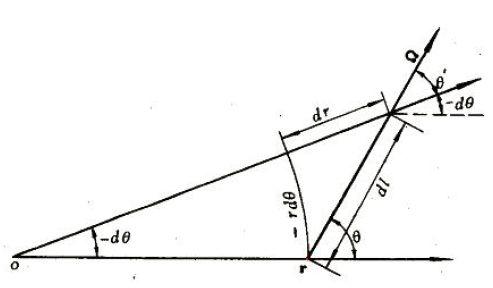

Migration Area
==============

Classical Definition in One-group Diffusion
-------------------------------------------

In one-group diffusion theory, migration area can be proven to be equal
to one-sixth of the average square of the flight distance from the
position where a neutron is born to the position where it is absorbed,
as shown in Equation :eq:`ma_defination`:

.. math::
  :label: ma_defination

   \label{eq::ma_defination}
       M^2 =\frac{D}{\Sigma_{a}} = \frac{1}{6} \overline{r^2}

In Equation :eq:`ma_defination`, :math:`M^2`
is migration area, :math:`D` is diffusion coefficient,
:math:`\Sigma_{a}` is absorption cross section and
:math:`\overline{r^2}` is the average square of crow flight length of
the neutron from the position where it is born to the position absorbed.

The derivation of this one-sixth relationship is under the assumption of
a point neutron source emitting neutrons (with the intensity of
:math:`S`) in an infinite homogeneous material. Through one-group
diffusion theory, the spatial scalar flux expression in polar
coordinates can be derived as

.. math::

   \label{eq::flux_diffusion}
       \phi(r) = \frac{S e^{-r/M}}{4 \pi r D}

With this, the probability of any neutron absorbed within a thin
spherical shell from :math:`r` to :math:`r+dr` is

.. math::

   p(r)dr = \frac{\Sigma_a \phi(r) dV}{S}
               = \frac{\Sigma_a \frac{S e^{-r/M}}{4 \pi r D} 4 \pi r^2 dr}{S}
               = \frac{1}{M^2} e^{-r/M} r dr

Using the probability density function for :math:`r` with the
integration formula of
:math:`\int_{0}^{\infty} r^n e^{-ar} dr = \frac{n!}{a^{n+1}}`, we can
compute the second moment of :math:`r` as

.. math::

   \overline{r^2} = \int_{0}^{\infty} r^2 p(r) dr 
                      = \frac{1}{M^2} \int_{0}^{\infty} r^3 e^{-r/M} dr
                      = \frac{1}{M^2} \frac{3!}{(1/M)^4} = 6 M^2

So we can get the relationship of
:math:`M^2 = \frac{1}{6} \overline{r^2}`.

Pure Absorber with Fixed Source
-------------------------------

Exponential Decay Model
~~~~~~~~~~~~~~~~~~~~~~~

In pure absorber, the length each neutron traveled before absorption
will just be the same result as exponential decay model, in which

.. math:: p(r) dr = e ^ {-\Sigma_a r} \Sigma_a dr

Then in this case the second moment of :math:`r` as

.. math::

   \overline{r^2} = \int_{0}^{\infty} r^2 p(r) dr 
                      = \Sigma_a \int_{0}^{\infty} r^2 e ^ {-\Sigma_a r} dr
                      = \frac{2}{\Sigma_a^2}

Neutron Transport in 1D Sphere
~~~~~~~~~~~~~~~~~~~~~~~~~~~~~~

If we start from NTE in the coordinates of 1D sphere, it is expected to
get the same results. Starting from the general expression of 1D NTE

.. math::

   \vec{\Omega} \cdot \nabla \psi(\vec{r}, E, \vec{\Omega}) 
               + \Sigma_t(\vec{r}, E) \psi(\vec{r}, E, \vec{\Omega}) = 
               Q(\vec{r}, E, \vec{\Omega})

First we need to specify the symbols which will be used to represent for
the spatial and angular variables as shown in the following figure. In
addition, :math:`\mu = cos \theta`.

The directional derivative of angular flux
:math:`\vec{\Omega} \cdot \nabla \psi(\vec{r}, E, \vec{\Omega}) = \frac{\partial \psi}{\partial l}`.
The movement of neutron will cause the change of :math:`r` and
:math:`\theta` simultaneously, thus

.. math:: \vec{\Omega} \cdot \nabla \psi(\vec{r}, E, \vec{\Omega}) = \frac{\partial \psi}{\partial l} = \frac{\partial \psi}{\partial r} \frac{\partial r}{\partial l} + \frac{\partial \psi}{\partial \mu} \frac{\partial \mu}{\partial l}

Besides,

.. math::

   \begin{aligned}
       & \frac{\partial r}{\partial l} = cos \theta = \mu
       \\
       & \frac{\partial \mu}{\partial l} = \frac{\partial \mu}{\partial \  \theta} \frac{\partial \theta}{\partial l} = - sin \theta (-\frac{-sin \theta}{r}) = \frac{1-\mu^2}{r}
       \end{aligned}

So we can get

.. math::

   \vec{\Omega} \cdot \nabla \psi(\vec{r}, E, \vec{\Omega}) =
        \frac{\partial \psi}{\partial r} \frac{\partial r}{\partial l} + \frac{\partial \psi}{\partial \mu} \frac{\partial \mu}{\partial l}
        = \mu \frac{\partial \psi}{\partial r} + \frac{1-\mu^2}{r} \frac{\partial \psi}{\partial \mu}

Then NTE in 1D sphere becomes

.. math::

   \mu \frac{\partial \psi}{\partial r} + \frac{1-\mu^2}{r} \frac{\partial \psi}{\partial \mu}
               + \Sigma_t \psi = 
               S

It should be mentioned here that in this equation, angular flux is
dependent on :math:`\mu` but no longer :math:`\vec{\Omega}`. In the case
of pure absorber with fixed source in the center, actually all neutrons
will fly along straight lines aligning with the origin, so we can always
have :math:`\mu = 1`. As a result, NTE becomes

.. math:: \frac{\partial \psi}{\partial r} + \Sigma_t \psi = S

